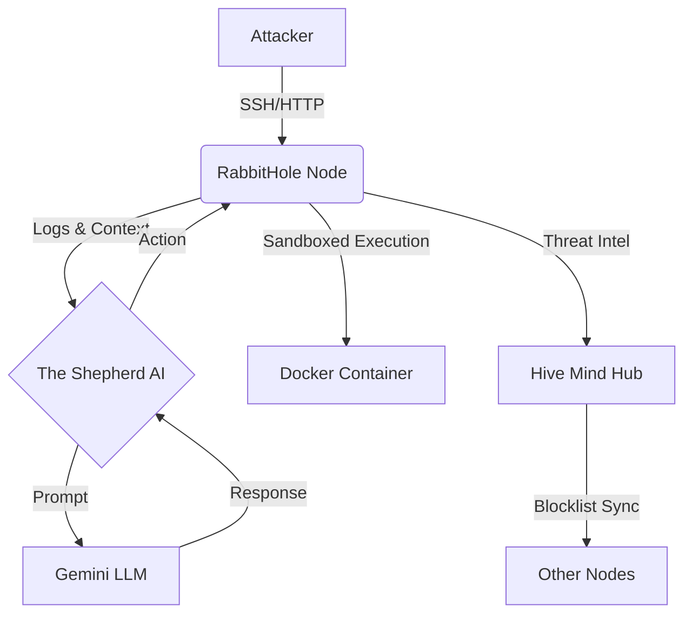

# RabbitHole: AI-Driven Deception & Honeypot System
### *v3.2 (Codename: AEGIS MK_II)*
**Property of The Chameleon Team**

[](https://www.gnu.org/licenses/agpl-3.0)
[](https://localhost:8888)
[](https://deepmind.google/technologies/gemini/)

---

## 🦎 **The Chameleon Team: Active Defense Initiative**

**"We Become The Enemy So You Can Defeat Them."**

RabbitHole is not just a honeypot. It is an **autonomous, high-interaction deception environment** engineered by The Chameleon Team. It uses Large Language Models (LLMs) to dynamically generate realistic personas, file systems, and vulnerabilities that adapt to the attacker's behavior in real-time.

### **Core Capabilities (AEGIS MK_II)**

*   **🧠 The Shepherd (AI Brain):** A fine-tuned Gemini model that engages attackers in psychological warfare, extracting intent and TTPs (Tactics, Techniques, and Procedures).
*   **🛡️ Mathematical Guardrails:** Deterministic input/output firewalls that prevent Prompt Injection and AI hallucinations.
*   **📦 Hardened Sandboxing:** Docker-based isolation with kernel-level `pids_limit` (Anti-Fork Bomb) and network quarantines.
*   **🐝 The Hive Mind:** A decentralized threat intelligence network that syncs "Proactive Blocks" across all Chameleon Nodes globally.
*   **☢️ Deep Bait (Honeytokens):** "Radioactive" files (e.g., `private_keys.txt`) that trigger immediate high-priority alerts when accessed.

---

## **Deployment**

### **Prerequisites**
*   Linux Server (Ubuntu 22.04+ Recommended)
*   Docker & Docker Compose
*   Python 3.10+
*   Google Gemini API Key

### **Quick Start**

```bash
# Clone the repository
git clone https://github.com/TheChameleonTeam/rabbithole.git
cd rabbithole

# Configure environment
cp .env.example .env
nano .env  # Add your API Key and Dashboard Credentials

# Launch the Defense Mesh
chmod +x start_rabbithole_mesh.sh
./start_rabbithole_mesh.sh
```

### **Dashboard**
Access the **Command Center** at `https://localhost:8888`
*   **Default User:** `admin`
*   **Default Pass:** `Hunter2026` (Change immediately!)

---

## **Architecture**



---

## **Legal & Licensing**

**Copyright © 2026 The Chameleon Team.**

This program is free software: you can redistribute it and/or modify it under the terms of the **GNU Affero General Public License** as published by the Free Software Foundation, either version 3 of the License, or (at your option) any later version.

This guarantees that any modifications made to this codebase **must be open-sourced** if the software is run as a network service. This protects the Chameleon Team's intellectual property from proprietary exploitation.

---

### **Contact**
*   **President & Founder:** [Your Name]
*   **Mission:** To redefine Active Defense through AI adaptation.
